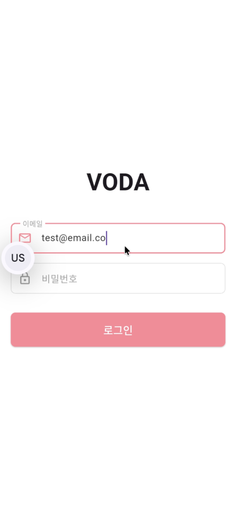
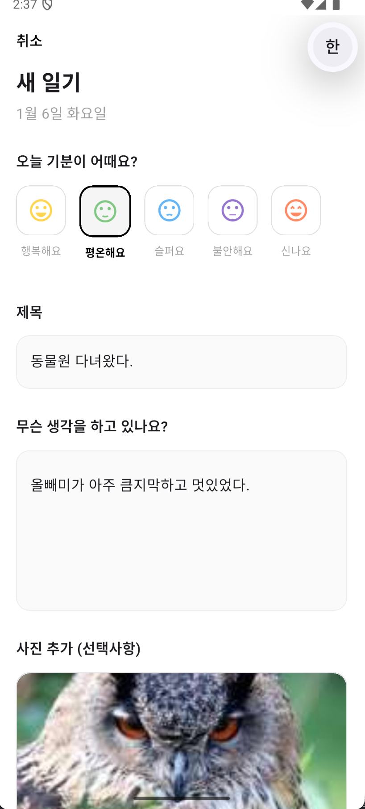
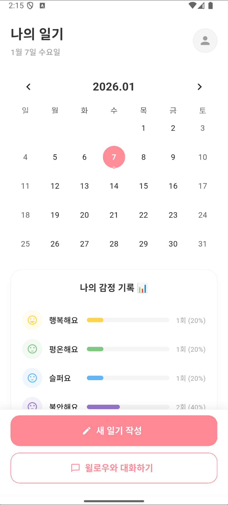
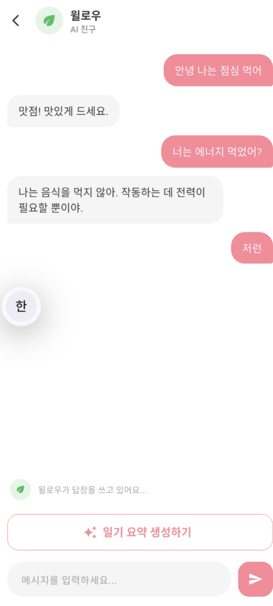

# 📖 VODA (보다): AI 기반 감정 기록 및 멘탈 케어 서비스

> **"나의 하루를 깊이 있게 들여다보다"**
>
> 사용자의 감정을 기록하고, AI와 소통하며 마음을 치유하는 모바일 다이어리 서비스입니다.

<br>

## 📅 프로젝트 기간
**2024.11.20 ~ 2024.12.07 (약 3주, 1인 개발)**

<br>

## 🛠️ 기술 스택 (Tech Stack)

### Backend
     

### Frontend (Mobile)
   

### DevOps & Tools
  

<br>

## 📱 주요 기능 및 시연 (Features & Demo)

| 로그인 및 회원가입 | 일기 작성 및 감정 선택 |
| :---: | :---: |
|  |  |
| **JWT & Redis** 기반 보안 로그인<br>Refresh Token을 통한 자동 로그인 구현 | **Multi-part** 이미지 업로드 구현<br>감정 이모티콘 및 태그 선택 기능 |

| 캘린더 및 통계 | AI 멘토링 및 상세 조회 |
| :---: | :---: |
|  |  |
| 월별 감정 흐름을 한눈에 파악<br>감정 분포 그래프 제공 | 작성된 일기 상세 조회<br>AI가 분석한 위로/공감 메시지 제공 |

<br>

## 🏗️ 시스템 아키텍처 및 핵심 구현 내용

### 1. JWT & Redis 기반 인증 시스템 구축
- **문제점:** Access Token 만료 시 잦은 로그아웃으로 인한 사용자 경험 저하.
- **해결책:** Refresh Token을 **Redis(TTL 설정)**에 저장하여 보안성과 편의성을 동시에 확보하고, Access Token 만료 시 자동으로 재발급하는 로직을 구현했습니다.

### 2. 이미지 및 데이터 처리 (Multipart/form-data)
- **구현:** Flutter(Dio)와 Spring Boot 간의 파일 업로드 통신을 구현했습니다.
- **최적화:** `AppConstants`를 활용하여 감정 데이터(아이콘, 색상, 코드)를 중앙에서 관리하도록 리팩토링하여 유지보수성을 높였습니다.

### 3. 예외 처리 및 안정성 확보
- **구현:** `GlobalExceptionHandler`와 커스텀 `BusinessException`을 도입했습니다.
- **효과:** 400/500 에러 발생 시 클라이언트에게 명확한 JSON 포맷의 에러 메시지를 전달하여 디버깅 및 사용자 안내를 표준화했습니다.

<br>

## 🚀 트러블 슈팅 (Trouble Shooting)

### 🔥 JSON 파싱 및 데이터 불일치 문제
- **상황:** 서버에서는 `mood`를 Enum Code(`HAPPY`)로, 클라이언트는 이모지(`🥰`)로 처리하여 매핑 에러가 발생했습니다.
- **해결:** `AppConstants`를 도입하여 **[서버 코드 - 라벨 - 아이콘 - 색상]**을 하나로 묶어 관리하는 'Single Source of Truth' 구조로 리팩토링하여 데이터 무결성을 확보했습니다.

### 🔒 보안 관련 이슈
- **상황:** `application.yaml` 등 민감 정보가 Git에 노출될 위험이 있었습니다.
- **해결:** `.gitignore` 설정 및 Git 캐시 삭제(`git rm --cached`)를 통해 민감 정보를 완벽하게 분리하고 로컬 환경과 배포 환경의 설정을 분리했습니다.

<br>

## 📂 프로젝트 구조 (Directory Structure)

```text
lib
├── common                  # 공통적으로 사용되는 상수, 설정, 유틸리티
│   ├── config              # API 클라이언트 및 설정
│   ├── app_colors.dart     # 앱 전반에 사용되는 색상 정의
│   ├── app_theme.dart      # 테마 설정
│   └── constants.dart      # 전역 상수 관리
│
├── components              # 앱 전반에서 재사용되는 공통 UI 컴포넌트
│   ├── voda_button.dart    # 공통 버튼 위젯
│   └── voda_text_field.dart # 공통 텍스트 필드 위젯
│
├── models                  # 데이터 모델 (JSON 파싱 및 데이터 구조 정의)
│   ├── auth_model.dart
│   ├── chat_message.dart
│   └── diary_model.dart
│
├── repositories            # 데이터 계층 (API 호출 및 데이터 처리 담당)
│   ├── auth_repository.dart
│   ├── chat_repository.dart
│   └── diary_repository.dart
│
├── viewmodels              # 상태 관리 (Provider, 비즈니스 로직 처리)
│   ├── auth_view_model.dart
│   ├── chat_view_model.dart
│   └── diary_view_model.dart
│
├── screens                 # 사용자가 보는 실제 화면 (Page)
│   ├── login_screen.dart
│   ├── home_screen.dart
│   ├── diary_write_screen.dart
│   ├── diary_detail_screen.dart
│   └── chat_screen.dart
│
├── widgets                 # 특정 화면에서만 사용되는 복잡한 UI 조각
│   ├── home_calendar.dart
│   ├── home_header.dart
│   └── home_diary_list.dart
│
└── main.dart               # 앱의 진입점 (Entry Point)